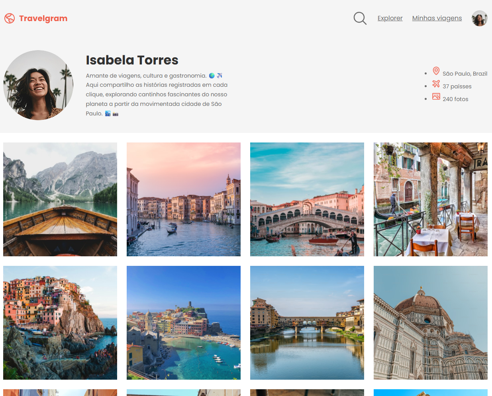

# 🌍 Perfil de Viagens - Travelgram

Este é um projeto desenvolvido durante a trilha **Fullstack** da **Rocketseat**, na aula sobre **layout com CSS**.

O objetivo foi criar uma interface de perfil de viagens, apresentando o uso de layout responsivo, estilização com CSS moderno e boas práticas de organização visual.

## ✨ Preview



## 🚀 Tecnologias usadas

- HTML
- CSS

## 📚 Conteúdo aprendido

- Organização de layout com `Flexbox` e `Grid`
- Estilização de componentes de interface
- Uso de ícones e imagens
- Responsividade básica

## 💼 Projeto feito por

- Desenvolvido por [@VicZambom](https://github.com/VicZambom)
- Aula da Rocketseat - Trilha Fullstack
- Módulo: **Layout com CSS**

---

### 📸 Sobre o layout

O projeto simula o perfil de uma criadora de conteúdo chamada **Isabela Torres**, onde são exibidas informações como:

- Localização
- Número de países visitados
- Galeria de fotos
- Biografia de viajante

---

## 📁 Como usar

1. Clone o repositório:

```bash
git clone https://github.com/VicZambom/Perfil-de-viagens.git
